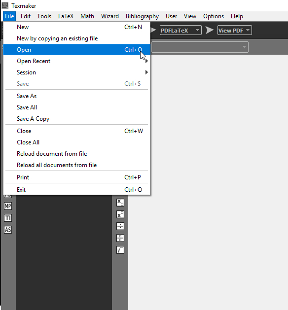

# AE4870A-Rocket-Motion Content:

1. The complete course planning. (It automatically compiles a pdf with the planning, and more importantly, it automatically generates all the taskwarrior commands to add your tasks to your tasklist (taskwarrior).)
2. Old exam solutions, please contribute with your solutions! (just git clone, type your solution in the latex and send me a pull request.)

# How to use
0. You can git clone this repository or fork it
1. You can edit and compile the pdf's in this repository with TexMaker (OpenSource):https://www.xm1math.net/texmaker/download.html
2. And then send a pull request after you have pushed your changes. 

To change (a copy of) this summary after you have installed TexMaker:
  0. Open Main.tex file in TexMaker:
  
  
  
  
  
  1. Make sure you have opened `Main.tex` and not `someChapterOrOther.tex` and click the triangle meaning "Run/compile". That exports the PDF to your/this directory.
  
  
  2. Click `Options>Define current document as "Master Document"`.
  
  
  3. Selected `PDFLatex` and `View PDF` (see next pic)
  
  3.a Press `f2`,`f11` to compile the bibliography, followed by `f2` to include the bibliography in the report. Then:
  
  4. Press `f6` to compile the pdf. (left triangle in pic below)
  
  
  
  5. Press `f7` to preview the pdf in the right half of your screen. (Right triangle in pic below)
  
  
  
## Configuring Texmaker for convenience ##
Normally you can switch between your tabs/files with `Alt+PageDown` and `Alt+PageUp`. However if you also have FLux installed on windows, those shortcuts are already mapped to reducing the blue content in your screen. The shortcuts wont work in that case. To switch between screens fast with your keyboard:

  7. Click Options.
  
  8. Click Configure Texmaker.
  
  

  9. Click tab: "Shortcuts" and scroll down to Action: "Next Documents".
  
  10. Click the "shortcut" next to `Next Document` and Press the shortcut you want, e.g. press `Ctrl+PageDown`.
  
  
  
  11. Then do the same for the `Previous Document`

If you are having troubles with any of the above steps/don't know how you do any of that, feel free to click on: "issue" and type your question :)
